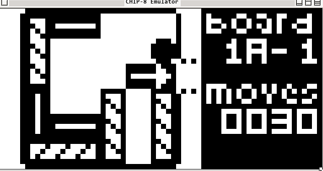
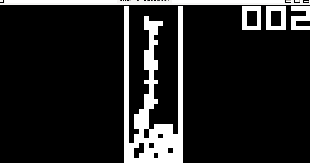

Chip-8 is a lightweight interpreted programming language, well known in the early 80s as a easy and fast way to play games in low resources environments.

Writing a Chip-8 is still a good way to understand how to manage resources in a limited environment, handle memory, cache, disk and logical operations.

# Images:

#### Rush Hour.ch8:



#### Tetris.ch8:



# Dependencies:

`Make, SDL3`

`Used System: Arch Linux 7.0.12-arch1-1`

# Usage:

After compiling the project, run the command below

`./chip8 <screen-scale> <delay> <ROM File.ch8>`

# 3.1 - Standard Chip-8 Instructions:

35 Instructions

```
            00E0 - CLS
            00EE - RET
            0nnn - SYS addr
            1nnn - JP addr
            2nnn - CALL addr
            3xkk - SE Vx, byte
            4xkk - SNE Vx, byte
            5xy0 - SE Vx, Vy
            6xkk - LD Vx, byte
            7xkk - ADD Vx, byte
            8xy0 - LD Vx, Vy
            8xy1 - OR Vx, Vy
            8xy2 - AND Vx, Vy
            8xy3 - XOR Vx, Vy
            8xy4 - ADD Vx, Vy
            8xy5 - SUB Vx, Vy
            8xy6 - SHR Vx {, Vy}
            8xy7 - SUBN Vx, Vy
            8xyE - SHL Vx {, Vy}
            9xy0 - SNE Vx, Vy
            Annn - LD I, addr
            Bnnn - JP V0, addr
            Cxkk - RND Vx, byte
            Dxyn - DRW Vx, Vy, nibble
            Ex9E - SKP Vx
            ExA1 - SKNP Vx
            Fx07 - LD Vx, DT
            Fx0A - LD Vx, K
            Fx15 - LD DT, Vx
            Fx18 - LD ST, Vx
            Fx1E - ADD I, Vx
            Fx29 - LD F, Vx
            Fx33 - LD B, Vx
            Fx55 - LD [I], Vx
            Fx65 - LD Vx, [I]
```

# References:

- https://multigesture.net/articles/how-to-write-an-emulator-chip-8-interpreter/

- http://devernay.free.fr/hacks/chip8/C8TECH10.HTM
